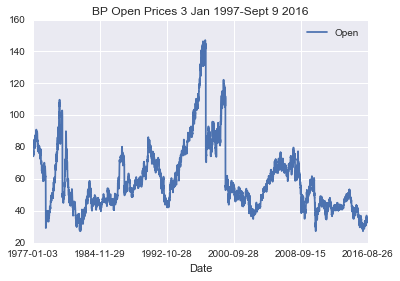
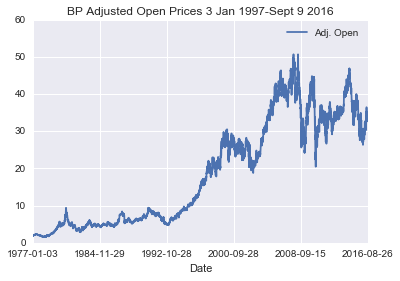
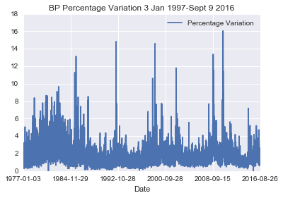
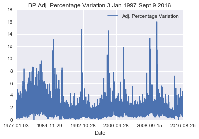
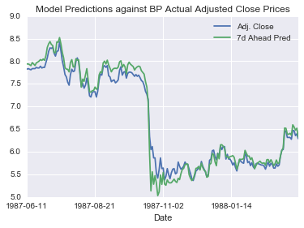

# Predicting Daily Adjusted Close Stock Prices
### Machine Learning in Trading: An Exploratory Study

Jessica Yung, October 2016

Udacity Machine Learning Nanodegree Capstone Project

# I. Definition

## I.1 Project Overview

### Introduction
People have used machine learning in trading for decades. Hedge funds, high-frequency trading shops and sole traders use all sorts of strategies, from Bayesian statistics to physics related strategies.

### Scope of this project
We will investigate **using machine learning in trading equities**, specifically to **predict equity prices for a 7-day period**. Equities are stocks - shares of companies like Apple and Google that are publically listed on the stock exchange. That means any licensed stock broker can trade those stocks. By trading, we mean buying and selling these shares on the stock exchange.

We will only tackle trading equities and not other more complex financial products because calculating returns for those products is more complex and equities are sufficiently interesting.

### Why trading is an interesting domain for machine learning
1. Firstly, there are many non-engineered features. If we include only equities, we already have over 10,000 equities globally. That makes for at least 10,000 potential non-engineered features. 

2. Secondly, there are many datapoints. Even access to only daily trading information gives us 30 years * 365 days = over 10,000 datapoints for each of many stocks. (This is only an estimate because trading does not take place on Sundays in all non-Israeli exchanges.) If we were to look at intraday figures, there's even more data: in January 2009, an average of 881,609 trades were made per day in equities on the London Stock Exchange [(Source: LSE Group)](http://www.lseg.com/media-centre/news/corporate-press-releases/185-million-electronic-equity-trades-across-london-stock-exchange-group-order-books-january).

3. It is also interesting because research in machine learning and statistics has affected how markets behave. There is no strategy or algorithm that will solve this problem or remain forever 'optimal' - if a profitable strategy is found, it may be copied by other people and so be priced in or it may be fought against or taken advantage of. This is more relevant to high-frequency trading than daily trading but nonetheless has an impact. 

### Aim of this project

The aim of this exploratory study is to get a feel for what types of features are involved in predicting stock prices and how different models perform in this setting. The challenges will be discussed in more detail in the Problem Statement.

Predicting stock prices accurately is difficult: there are many factors that influence stock prices and a lot of noise.

This exploratory study does not aim to produce a state-of-the-art, better-than-benchmark-buy-and-hold (transaction costs included) trading strategy - that is extremely difficult and is a challenge even for top trading firms. 

### Data used in this project

There is one primary dataset for this project and two supplementary datasets.

* The primary dataset is a CSV with all the daily stock prices from 1977 for stocks listed on the the London Stock Exchange. This dataset was downloaded from Quandl. 
* The first supplementary dataset is a spreadsheet listing the stocks currently listed on the London Stock Exchange with information such as what each listed company's stock symbol is and which sector they belong to. This spreadsheet was downloaded from the London Stock Exchange website.
* The second supplementary dataset is a CSV with Open, High, Low, and Close data for the FTSE100 from April 1, 1984 to Sept 9, 2016. This data was scraped from Google Finance and is used for feature engineering.

The features and characteristics of the primary dataset will be discussed more thoroughly in Section II: Data Exploration.

## I.2 Problem Statement

### Problem

Build a stock price predictor that satifies:
<table>
<th>Category</th><th>Details</th>
<tr><td>Input</td><td>Daily trade data over a `start_date - end_date`. Daily trade data consists of adjusted and unadjusted Open, High, Low, Close figures for a set of stocks S.</td></tr>
<tr><td>Output</td><td><ul><li>Projected estimates of Adjusted Close prices for query dates for pre-chosen stock BP in S.</li><li>Results satisfy predicted stock value 7 days out is within +/- 5% of actual value, on average.</li></td></tr>
</table>

Glossary:
* **Adjusted prices** are prices amended to include any distributions and corporate actions such as stock splits (splitting one stock into two which would halve the price), dividends (giving stockholders cash as a fraction of profits) that occurred at any time before the next day's open.
* **BP** is the stock symbol for British Petroleum, an energy company.

### Interesting characteristics of this problem
There are a few interesting characteristics of this problem compared to previous projects in the Machine Learning Engineer Nanodegree.

1. Predicting multiple outputs: We will predict the adjusted close prices for 7 days after the last input date.
2. Extracting and engineering the input data as opposed to being given input data.
3. We will be using time series data.

### Challenges
1. The model has to be run for dates not within the training set for the model to be 'fair'. But given there may be big shifts in how people view the markets from year to year, it may be hard for the model to generalise from one year to the next.
2. Energy companies' stock prices are volatile so they may be harder to predict.

### Analysis of Problem

This is a regression problem (as opposed to a classification problem) because we are predicting daily Adjusted Close prices for a stock. These prices are continuous.

Compare this to a related problem: If this were high-frequency trading and we were trying to predict the stock price in the next nanosecond we could tackle price prediction as a binary classification problem instead (does the price go up or down?).

It's not immediately obvious what kind of model will be best.

Characteristic of problem: 
- Time-series data.
- Noisy data
- Datapoints (prices of different stocks) are not independent of each other -> Naive Bayes is not appropriate
- Many features. (Daily open, high, low, adjusted close for many stocks) -> 
- Regression problem (continuous output).
- Training cost or time: it is not critical to keep this lower than 12 hours because we are predicting daily prices based on stats from prior days' trading. 
- Prediction time: Again not critical to keep this low. Anything within an hour would do.

### Strategy
I intend to do the following:

1. Explore the data
- Come up with a basic model with which I can predict the next day's prices and then the next 7 days' prices as a benchmark
- Try adding different features and using different algorithms
    - Features include x-day moving averages of BP stocks, stocks in the oil industry, and indices such as the FTSE 100. 
- Assess which model is best using the metric described below.

### Expected Solution

The solution will be 7 predicted prices for each trading day within 7 trading days after the last date in the input date range. We will compare the 7 predicted prices with the actual adjusted close prices.

## I.3 Metrics

We will measure performance as the **root mean squared percentage error** (difference between the stock's actual and predicted Adjusted Close prices). 

Reasoning: 
1. This represents the error between the actual price and the predicted price. 
2. We have to square it and then take the square root because if we don't square it, errors from overestimates and underestimates will cancel each other out.

We will also informally consider **the range of root mean squared percentage error** as a secondary metric - we want a model with lower error variance because a series of small good trades (gaining \$1 ten times) can be more than cancelled out by a single large-magnitude bad trade (losing \$50 once).

We will not consider transaction costs (you have to pay every time you trade and that will reduce profits).


# II. Analysis

## II.1 Data Exploration

### Description of Primary Dataset
The primary dataset used is daily stock data for stocks on the London Stock Exchange (LSE). The date range for stock data varies depending on when the stock went public. The furthest date was in the year 1954. The most recent date in the dataset was 9 September 2016. The data was taken from Quandl's free access database.

All the data is in one comma-separated value file (CSV), with each row being one datapoint. There are over 14 million datapoints in the dataset. 

Each row has 14 columns. That means we have 14 features for each stock on every trading day since the year when the stock was tradable (from 1954 onwards). Unless otherwise indicated, the column values are all floats.

<table>
<th>Column</th><th>Format or accuracy if float</th><th>Meaning</th>
<tr><td>Stock symbol</td><td>string</td><td>How the stock is represented on the London Stock Exchange. E.g. GOOGLE's stock symbol is GOOGL.</td></tr>
<tr><td>Date</td><td>YYYY-MM-DD</td><td></td></tr>
<tr><td>Open</td><td>given to 2 decimal places (2 d.p.)</td><td>Price of stock when the market opened on that day in GBP £.</td></tr>
<tr><td>High</td><td>2 d.p.</td><td>Maximum price of the stock during the trading day in GBP £.</td></tr>
<tr><td>Low</td><td>2 d.p.</td><td>Minimum price of the stock during the trading day in GBP £.</td></tr>
<tr><td>Close</td><td>2 d.p.</td><td>Price of stock when the market closed on that day in GBP £.</td></tr>
<tr><td>Volume</td><td>1 d.p.</td><td>The number of shares of that stock traded on that day.</td></tr>
<tr><td>Ex-Dividend</td><td>1 d.p.</td><td>The value of the declared or upcoming dividend that will belong to the seller of the stock share rather than the buyer. Dividend is profits distributed to shareholders. If the upcoming dividend will be given to the buyer, Ex-Dividend = 0.</td></tr>
<tr><td>Split Ratio</td><td>1 d.p.</td><td>A company may choose to split their stock. E.g. a 2.0 (2:1) split ratio means shareholders get two new shares for every share they hold. This halves the price to preserve the market capitalisation (total value) of the company.</td></tr>
<tr><td>Adjusted Open</td><td>6 d.p.</td><td>Adjusted opening price (price of stock when the market opened on that day). Adjusted prices are prices amended to include any distributions and corporate actions such as stock splits (splitting one stock into two which would halve the price), dividends (giving stockholders cash as a fraction of profits) that occurred at any time before the next day's open.</td></tr>
<tr><td>Adjusted High</td><td>6 d.p.</td><td>See Adjusted Open and High.</td></tr>
<tr><td>Adjusted Low</td><td>6 d.p.</td><td>See Adjusted Open and Low.</td></tr>
<tr><td>Adjusted Close</td><td>6 d.p.</td><td>See Adjusted Open and Close.</td></tr>
<tr><td>Adjusted Volume</td><td>1 d.p.</td><td>See Adjusted Open and  Volume.</td></tr>
</table>

Reference: [Definition of Ex-Dividend (Investopedia)](http://www.investopedia.com/terms/e/ex-dividend.asp)

#### Data sample

<table>
<tr><th></th><th>Symbol</th><th>Date</th><th>Open</th><th>High</th><th>Low</th><th>Close</th><th>Volume</th><th>Ex-Dividend</th><th>Split Ratio</th><th>Adj. Open</th><th>Adj. High</th><th>Adj. Low</th><th>Adj. Close</th><th>Adj. Volume</th></tr>
<tr><td>0</td><td>A</td><td>1999-11-18</td><td>45.50</td><td>50.00</td><td>40.00</td><td>44.00</td><td>44739900.0</td><td>0.0</td><td>1.0</td><td>43.471810</td><td>47.771219</td><td>38.216975</td><td>42.038673</td><td>44739900.0</td></tr>
<tr><td>1</td><td>A</td><td>1999-11-19</td><td>42.94</td><td>43.00</td><td>39.81</td><td>40.38</td><td>10897100.0</td><td>0.0</td><td>1.0</td><td>41.025923</td><td>41.083249</td><td>38.035445</td><td>38.580037</td><td>10897100.0</td></tr>
<tr><td>2</td><td>A</td><td>1999-11-22</td><td>41.31</td><td>44.00</td><td>40.06</td><td>44.00</td><td>4705200.0</td><td>0.0</td><td>1.0</td><td>39.468581</td><td>42.038673</td><td>38.274301</td><td>42.038673</td><td>4705200.0</td></tr>
<tr><td>3</td><td>A</td><td>1999-11-23</td><td>42.50</td><td>43.63</td><td>40.25</td><td>40.25</td><td>4274400.0</td><td>0.0</td><td>1.0</td><td>40.605536</td><td>41.685166</td><td>38.455832</td><td>38.455832</td><td>4274400.0</td></tr>
<tr><td>4</td><td>A</td><td>1999-11-24</td><td>40.13</td><td>41.94</td><td>40.00</td><td>41.06</td><td>3464400.0</td><td>0.0</td><td>1.0</td><td>38.341181</td><td>40.070499</td><td>38.216975</td><td>39.229725</td><td>3464400.0</td></tr>
</table>
*Obtained using `df.head()`*

### Description of supplementary dataset (FTSE100)

I wanted to add features that corresponded to the general market trend and thought the FTSE100 would be a good representation. The FTSE100 as a single index was not included in my primary dataset, so I obtained the data by scraping Google Finance with a python script (see `google-finance-scraper.py`).

The supplementary dataset has Open, High, Low, Close data in the date range April 1, 1984 - September 9, 2016.

### Defining Characteristics about Stock Data
1. **Limit Down Circuit Breakers**: When the stock price falls by Limit Down during one trading day, trading curbs may kick in. This may mean no further trading of that stock is allowed on that day unless the trading prices are above the Limit Down. Curbs and Limit Downs vary by exchange.
    - This reduces the maximum daily variation of stock prices.

### Dataset Statistics 

The summary statistics for the dataset are not too meaningful, but it gives us an idea of the **variance within the dataset**. The standard deviation of the adjusted close price is of magnitude 10^3 ($1000), and the standard deviation of adjusted volume is of magnitude 10^6 (1,000,000 shares). 

The summary statistics suggest that the data is **positively skewed**. 


<table>
<tr><th></th><th>Open</th><th>High</th><th>Low</th><th>Close</th><th>Volume</th><th>Ex-Dividend</th><th>Split Ratio</th><th>Adj. Open</th><th>Adj. High</th><th>Adj. Low</th><th>Adj. Close</th><th>Adj. Volume</th></tr>
<tr><td>mean</td><td>7.092291e+01</td><td>7.188109e+01</td><td>7.047024e+01</td><td>7.120251e+01</td><td>1.182026e+06</td><td>1.982789e-03</td><td>1.000210e+00</td><td>7.518079e+01</td><td>7.633755e+01</td><td>7.451613e+01</td><td>7.544570e+01</td><td>1.402925e+06</td></tr>
<tr><td>std</td><td>2.193723e+03</td><td>2.220224e+03</td><td>2.191789e+03</td><td>2.206792e+03</td><td>8.868551e+06</td><td>3.370723e-01</td><td>2.165061e-02</td><td>2.266636e+03</td><td>2.295340e+03</td><td>2.261718e+03</td><td>2.279264e+03</td><td>6.620816e+06</td></tr>
<tr><td>min</td><td>0.000000e+00</td><td>0.000000e+00</td><td>0.000000e+00</td><td>0.000000e+00</td><td>0.000000e+00</td><td>0.000000e+00</td><td>1.000000e-02</td><td>0.000000e+00</td><td>0.000000e+00</td><td>0.000000e+00</td><td>0.000000e+00</td><td>0.000000e+00</td></tr>
<tr><td>max</td><td>2.281800e+05</td><td>2.293740e+05</td><td>2.275300e+05</td><td>2.293000e+05</td><td>6.674913e+09</td><td>9.625000e+02</td><td>5.000000e+01</td><td>2.281800e+05</td><td>2.293740e+05</td><td>2.275300e+05</td><td>2.293000e+05</td><td>2.304019e+09</td></tr>
</table>

I have checked the count is constant across all columns, i.e. that there are no missing values.

### Interesting observations: Abnormalities in dataset
The minimum Open, High, Low and Close are all zero. If a stock trades at a price of zero, it kind of doesn't exist. I will examine this in the Data Preprocessing section.

### BP Statistics

More meaningful than the summary statistics for all 3,000+ stocks is the summary statistics for one stock. Since one of the stocks we are hoping to predict is that of BP (British Petroleum), let's examine the corresponding summary statistics.

<table>
<tr><th></th><th>Open</th><th>High</th><th>Low</th><th>Close</th><th>Volume</th><th>Ex-Dividend</th><th>Split Ratio</th><th>Adj. Open</th><th>Adj. High</th><th>Adj. Low</th><th>Adj. Close</th><th>Adj. Volume</th><th>Daily Variation</th></tr>
<tr><td>mean</td><td>59.428433</td><td>59.908222</td><td>58.943809</td><td>59.446137</td><td>2.816082e+06</td><td>0.004626</td><td>1.000400</td><td>18.705367</td><td>18.855246</td><td>18.547576</td><td>18.707358</td><td>3.408274e+06</td><td>0.0</td></tr>
<tr><td>std</td><td>20.589378</td><td>20.676885</td><td>20.513272</td><td>20.598500</td><td>7.217241e+06</td><td>0.048270</td><td>0.019987</td><td>14.127674</td><td>14.228791</td><td>14.011973</td><td>14.122609</td><td>7.532096e+06</td><td>0.0</td></tr>
<tr><td>min</td><td>27.250000</td><td>27.850000</td><td>26.500000</td><td>27.020000</td><td>0.000000e+00</td><td>0.000000</td><td>1.000000</td><td>1.522366</td><td>1.528872</td><td>1.503109</td><td>1.522366</td><td>0.000000e+00</td><td>0.0</td></tr>
<tr><td>25%</td><td>44.750000</td><td>45.162500</td><td>44.250000</td><td>44.770000</td><td>1.831500e+05</td><td>0.000000</td><td>1.000000</td><td>5.426399</td><td>5.493816</td><td>5.373302</td><td>5.442764</td><td>7.536000e+05</td><td>0.0</td></tr>
<tr><td>50%</td><td>53.940000</td><td>54.360000</td><td>53.500000</td><td>53.940000</td><td>6.371500e+05</td><td>0.000000</td><td>1.000000</td><td>15.077767</td><td>15.165769</td><td>15.033179</td><td>15.099474</td><td>1.904100e+06</td><td>0.0</td></tr>
<tr><td>75%</td><td>69.750000</td><td>70.230000</td><td>69.327500</td><td>69.795000</td><td>3.784475e+06</td><td>0.000000</td><td>1.000000</td><td>31.849522</td><td>32.207689</td><td>31.524772</td><td>31.889513</td><td>4.051675e+06</td><td>0.0</td></tr>
<tr><td>max</td><td>147.120000</td><td>147.380000</td><td>146.380000</td><td>146.500000</td><td>2.408085e+08</td><td>0.840000</td><td>2.000000</td><td>50.669004</td><td>50.988683</td><td>50.039144</td><td>50.533702</td><td>2.408085e+08</td><td>0.0</td></tr>
</table>

I have checked the count is 10010 across all columns, i.e. that there are no missing values.

This is much better understood with a visualisation of the BP data.

## II.2 Exploratory Visualisations

### Open and Adjusted Open Prices
Let's first get an idea of the open and adjusted open prices. This is equivalent to visualising the the close and adjusted close prices - the variable we want to predict - shifted by one day.




*Prices are in GBP £.*

#### Observations
1. **Adjusted vs non-adjusted figures** It is extraordinary: the adjusted open and the open are radically different for BP, whereas with stock 'A' in the first few rows of the df, Adj. Open and Open had similar values. This makes sense because some stocks that have few corporate actions e.g. stocks that don't have stock splits or give out dividends will require little value adjustment.
    - Since we are predicting the Adjusted Close, my guess is that the Adjusted figures (Open, High, Low, Volume) will be more useful in predicting the adjusted price. The non-adjusted figures (specifically Volume) may still useful in predicting momentum.

2. **Trend** The non-adjusted prices do not show an upward trend. The adjusted open prices show somewhat of an upward trend but it has been too volatile in recent years to draw any conclusions.

3. **Volatility** The stock price looks volatile, which is expected for an oil stock. From the descriptive statistics, the mean daily percentage variation is 1.72% and the maximum daily percentage variation is 16.0%.

### Volatility: Percentage Variation

To examine the volatility of BP stock, I constructed the features Percentage Variation and Adj. Percentage Variation, where

`Percentage Variation = (High - Low)/Open * 100`.




#### Observations
The Adjusted Percentage Variation and Percentage Variation look similar. There does not seem to be marked trends. It is of note that the stocks are consistently volatile with typical percentage variation of 0-4% in recent years, punctuated with spikes of extremely volatile periods of up to 16% variation.

## II.3 Algorithms and techniques


### Algorithm

I intend to use **linear regression**. 

#### Algorithm Description

Linear Regression is a way of modelling data by observing data and constructing an equation that minimises error. This regression is linear because the equation takes the form
$$\hat y = \sum \beta_i x_i$$

where $y$ is what we want to predict (stock prices) and $x_i$s are features such as the date. The hat on top of $y$ indicates it is an estimate.

That is, this regression is linear because the $x_i$s all have degree 1.


#### Algorithm Justification
1. I am using a **linear algorithm** because the the **signal-to-noise ratio in trading is low** and more complicated models seem like they would overfit.
2. A linear regression is appropriate because this is a **regression problem** - that is, the output are continuous. 
    - Note that *regression* in linear regression does not mean the same thing as *regression* in a regression problem.

#### Algorithm Parameters
There are only four parameters for `LinearRegression`:
- `fit_intercept` is set to True by default; setting it to false assumes the data is centered and will not produce better results.
- `normalize` normalizes the regressors X before regression. It is set to `False` by default.
- `copy_X` alters whether or not X may be overwritten, which does not affect the result.
- `n_jobs` can provide a speedup if the problem is large and you ask the algorithm to use more CPUs, but it will not change error measures.

Within these, there is only one parameter that it may be useful to adjust (`normalize`) to improve the error of the result.

### Techniques

1. **Time-series train-test split**
    - We will train our model on what we'll call the **training set**, a subset of the data that we have.
    - To make sure our model generalises, we need to test it on some data it has not seen before and evaluate how well it does predicting on that data. 
    - To do this, we need to set aside data for testing our model - the **test set**.
    - Because our data is time series data (there is some ordering to it and the ordering influences prices), we cannot shuffle the data.
    - If the data were shuffled, e.g. the adjusted close price for 1 Sept 2016 might be in the training set. We might then be asked to predict the adjusted close prices for the 7 days after 31 Aug 2016, which would include the price for 1 Sept 2016 which we'd have seen before. That's cheating.
    - So we cannot use sklearn's `train_test_split` function which automatically shuffles the data. Instead, I will write my own function.
2. **Time-series cross-validation**
    - But testing on only one test set and training on only one training set isn't robust enough. What if the test or training sets we choose have special characteristics that aren't common to other datasets?
    - To make our evaluation more robust so we choose the best model, it's better if we can run multiple train-test cycles. 
    - To do this, I wrote the function `execute()`. In this function, I set a number of train-test cycles (`steps`), a total length of the train-test data (`periods` datapoints) and a number of datapoints between the starting points of each consecutive train-test cycle (`buffer_step`).
  

## II.4 Benchmark

The benchmark given in the project outline was +/- 5% of the stock price 7 days out. That seems reasonable to start.

That is, our benchmark will be a **root mean squared percentage error of 5%**.

# III. Methodology

## III.1 Data Preprocessing

### Minor edits
1. On opening the CSV and sampling it with `df.head()`, I realised the CSV had no header. I added a header to the CSV:
```python
df = pd.read_csv('~/lse-data/lse/WIKI_20160909.csv', header=None, names=header_names)
```
where `header_names` was an slightly edited header I'd obtained from downloading the data for an individual stock from Quandl.

### Examining Abnormalities

I noted above that there were datapoints with opening price, high, low and closing price of 0.0. Were these mistakes? On investigating the data, it is plausble these were not mistakes.

<table>
<tr><th></th><th>Symbol</th><th>Date</th><th>Open</th><th>High</th><th>Low</th><th>Close</th><th>Volume</th><th>Ex-Dividend</th><th>Split Ratio</th><th>Adj. Open</th><th>Adj. High</th><th>Adj. Low</th><th>Adj. Close</th><th>Adj. Volume</th></tr>
<tr><td>1047193</td><td>ARWR</td><td>2002-10-11</td><td>0.0</td><td>0.00</td><td>0.0</td><td>0.00</td><td>65000.0</td><td>0.0</td><td>1.0</td><td>0.0</td><td>0.00</td><td>0.0</td><td>0.000000</td><td>100.000000</td></tr>
<tr><td>1047194</td><td>ARWR</td><td>2002-10-14</td><td>0.0</td><td>0.00</td><td>0.0</td><td>0.00</td><td>0.0</td><td>0.0</td><td>1.0</td><td>0.0</td><td>0.00</td><td>0.0</td><td>0.000000</td><td>0.000000</td></tr>
<tr><td>7608936</td><td>LFVN</td><td>2003-02-21</td><td>0.0</td><td>0.01</td><td>0.0</td><td>0.01</td><td>27200.0</td><td>0.0</td><td>1.0</td><td>0.0</td><td>4.76</td><td>0.0</td><td>4.760000</td><td>57.142857</td></tr>
</table>

I've included three examples in the table above. The third example shows that the figures may not actually be zero but may be zero to one or two decimal places: the open and low prices were 0.0, but the high and close prices were 0.01.

I assembled a list of stocks where the open or close was equal to 0 and will examine individual stocks on the list if they end up as features I'd like to use in my model.

### Feature Engineering

### 1. Daily and Percentage Variation

Reasoning: This is an indicator of how volatile prices have been. If the daily variation has been higher recently, that may mean there is a lot of uncertainty and that we can expect more fluctuations or that we shouldn't take big one-day changes too seriously when considering long-term predictions. 

I calculated the daily absolute and percentage variation (adjusted and unadjusted) for the entire data frame.

### 2. Prices of related stocks (Oil stocks)

Reasoning: BP's stock price is affected by how people feel about oil in general. Thus prices of oil stocks may correlate positively or negatively (if they are direct competitors) with BP's prices.

I obtained a list of oil companies listed on the LSE by searching for stocks with the same group code (537 for oil) in `list-of-all-securities-ex-debt.csv`.

Unfortunately there was only one other oil stock on my list that I found in this database (`GAIA`), so instead of creating an aggregated dataframe, I only included `GAIA`'s data in my additional set of features.

Improvement for future studies: Collect data from another data source to come up with a more informative feature.

#### Adding GAIA Features
The GAIA trading dates started on 1999-10-29 whereas the BP trading dates started much earlier, so that cut out a large portion of the dataset. Data had to be taken out because it did not make sense to create proxy values for 20+ years' of volatile price data.

**Complications** There was also a discrepancy in the trading dates. We have data for BP and GAIA on every trading day from 1999-10-29 to 2014-10-02, but beyond that the data for GAIA is incomplete. There was no information on GAIA trading on the second, fourth or fifth of October 2014 (whereas there was for BP). Thus our dataset is pared down even further to a size of 3754 as opposed to 10010 for BP. This is a huge cut.

### 3. Prices of FTSE100

Reasoning: Stock prices are also affected by how people feel about the market in general. The FTSE100 is fairly representative of the performance of the market in general, so including it as a feature can help us account for that aspect.

**Complications** There were 158 dates for which we had BP trading data but not FTSE trading data. (This is unexpected because the FTSE should have values on all trading days. The discrepancy is likely due to problems with the data source. This is unexpected because the data source for FTSE prices was Google Finance, which should be reliable.) 

But because there were only 158 NaNs and they were spread thinly over 8000 datapoints, it made it impossible to truncate a large section with no NaNs that would be large enough to do multiple rounds of meaningful training and testing on. 

I thus proxied the missing prices by taking the means of the the FTSE prices from the trading day before and the trading day after. If those were also NaNs, I moved either one day forward or one day backward. (See `# Proxy remaining NaNs` in 1.2.2.3.) Since the FTSE does not usually fluctuate wildly, I considered the mean to be a reasonable proxy.

As with prices of oil stocks, an improvement would be to consult another data source to fill in the gaps.

## III.2 Initial implementation
I initially implemented the Linear Regression algorithm with the following basic features:
* Adjusted Close prices on each of the 7 days prior to the first prediction date
* Max Adjusted High and Min Adjusted Low for that 7-day period prior to the first prediction date.

### Process:
1. Construct dataframe `X` containing initial features and dataframe `y` with 'Adjusted Close' prices.
    - This required some setting up to extract the relevant features from the dataset and put them in an appropriately formatted dataframe. This is in the first half of `prepare_train_test()` function in part 2.1 of `III. Methodology - Code.ipynb`.
    - The `y` target `nday_prices` had prices for the next `n` days.
2. Split `X` and `y` into training and test datasets.
    - I wrote my own function to do this (initially in `train_test_split_noshuffle` before I absorbed it into `prepare_train_test()`) instead of using sklearn's `train_test_split`. This was because sklearn's function automatically shuffles the data. Shuffling the data is okay and desired for situations in which data is not ordered, but is not okay for time-series data. 
    - As stated in the *Algorithms and Techniques* section, if the data were shuffled, e.g. the adjusted close price for 1 Sept 2016 might be in the training set. We might then be asked to predict the adjusted close prices for the 7 days after 31 Aug 2016, which would include the price for 1 Sept 2016 which we'd have seen before. That's cheating.
3. Train model on training data.
    - Because there were multiple outputs to predict in `nday_prices` (the model had to forecast prices for each of the 7 trading days after the last date it was given), I wrapped `MultiOutputRegressor` from sklearn's `multioutput` module around my classifier.
    - This is in the first half of the function `classify_and_metrics` in `2.2 Classifier` in `III. Methodology - Code.ipynb`.
4. Ask model to predict prices on test features.
5. Print metrics
    - I included this in `classify_and_metrics()` using my helper functions `rmsp()` (root mean squared percentage error) and `print_metrics()`. See Section `2.2 Classifier` in `III. Methodology - Code.ipynb`.

#### Refactoring
I refactored the code so that I could run a full (1) train-test split, (2) train classifier, (3) test classifier and print metrics cycle using only one line. To do this, I wrapped all the functions those processes with the `execute()` function.

### Initial Results
The results are shown below. I also tried using an SVM regression for comparison. 

#### Linear Regression
<table>
<th>Days after last training date</th><th>Mean Root mean squared daily percentage error (across 8 distinct train-test sets)</th>
<tr><td>1</td><td>1.669</td></tr>
<tr><td>2</td><td>2.422</td></tr>
<tr><td>3</td><td>2.968</td></tr>
<tr><td>4</td><td>3.407</td></tr>
<tr><td>5</td><td>3.834</td></tr>
<tr><td>6</td><td>4.230</td></tr>
<tr><td>7</td><td>4.590</td></tr>
</table>

Mean R2 score: 0.807. Ranged from 0.606 to 0.936.

#### SVM.SVR
<table>
<th>Days after last training date</th><th>Mean Root mean squared daily percentage error (across 8 distinct train-test sets)</th>
<tr><td>1</td><td>11.230</td></tr>
<tr><td>2</td><td>11.460</td></tr>
<tr><td>3</td><td>11.761</td></tr>
<tr><td>4</td><td>12.022</td></tr>
<tr><td>5</td><td>12.323</td></tr>
<tr><td>6</td><td>12.667</td></tr>
<tr><td>7</td><td>13.060</td></tr>
</table>
Mean R2 score: -2.044. Ranged from -9.156 to 0.822.

The Linear Regression did surprisingly well, with a mean R2 score above 0.807 overall for 7-day predictions and a mean RMS percentage error of under 5% for forecasts 7 days away. 

The SVM regression did horribly - it had a negative mean R2 score (-2.044) and negative median R2 score, which means it was worse than guessing randomly. It had a mean RMS percentage error of over 24% for all number-of-days ahead predicted.

It is impressive that the Linear Regression model did so well with such basic features.

## III.4 Refinement

### 1. Adjusting parameters

As discussed in Analysis: Algorithm Parameters, there is only one parameter that it may be useful to adjust (`normalize`).

I ran the algorithm with `normalize=True` to see if it produced better results. The metrics returned were exactly the same as when, by default, `normalize=False`.

### 2. Add features (Feature Selection)

I then experimented with adding the features I'd engineered earlier. (See *Data Preprocessing: Feature Engineering* for more details on how these features came about.)

#### 2.1 Adding more of the same type of features:

In the first implementation, I only used prices from the 7 days running up to the first prediction day. I then tried using prices from 10, 14, 21 and 30 days running up to the first prediction day. 

Reasoning: If we have more data, it makes sense to use it if we are confident it will give us better results.

To do this, I changed the value of the parameter `days` in the function `execute`, which trains and tests the classifier and prints metrics. 


#### Mean Daily Error across 15 trials
<table>
<th>Day to predict</th><th>7d (used)</th><th>10d</th><th>14d</th><th>21d</th><th>30d</th><th>100d</th>
<tr><td>1</td><td>1.669</td><td>1.732</td><td>1.729</td><td>1.746</td><td>1.784</td><td>1.924</td></tr>
<tr><td>2</td><td>2.422</td><td>2.543</td><td>2.526</td><td>2.555</td><td>2.593</td><td>2.768</td></tr>
<tr><td>3</td><td>2.968</td><td>3.138</td><td>3.103</td><td>3.113</td><td>3.152</td><td>3.370</td></tr>
<tr><td>4</td><td>3.407</td><td>3.579</td><td>3.586</td><td>3.586</td><td>3.633</td><td>3.890</td></tr>
<tr><td>5</td><td>3.834</td><td>3.939</td><td>4.002</td><td>3.991</td><td>4.048</td><td>4.355</td></tr>
<tr><td>6</td><td>4.230</td><td>4.269</td><td>4.372</td><td>4.342</td><td>4.392</td><td>4.769</td></tr>
<tr><td>7</td><td>4.590</td><td>4.543</td><td>4.702</td><td>4.658</td><td>4.705</td><td>5.163</td></tr>
</table>

We can see that mean RMS percentage error is slightly smaller in one instance (using 10d instead of 7d to predict precisely 7 days ahead),but otherwise that mean RMS percentage error is greater as the number of days of data given increases.

This is because more days' of data in this case means more features (e.g. for 100 days' of data we have 102 features). This increases the risk of overfitting.


#### 2.2 Adding GAIA (Oil Stock) Prices

There were far fewer datapoints to work with because of date inconsistencies (3753 datapoints vs 10010 for the BP-only model), so I decreased the step length (the difference between start dates) between consecutive trials to 200 from 500. This does not affect individual trial performance, but reduces the variety of data used for trials. We should bear this in mind when comparing performance of adding GAIA prices as features and not adding GAIA prices as features. 

<table>
<th>Day to predict</th><th>7d (no GAIA)</th><th>7d (GAIA)</th><th>10d (no GAIA)</th><th>10d (GAIA)</th>
<tr><td>1</td><td>1.669</td><td>1.744</td><td>1.732</td><td>1.751</td></tr>
<tr><td>2</td><td>2.422</td><td>2.444</td><td>2.543</td><td>2.467</td></tr>
<tr><td>3</td><td>2.968</td><td>2.938</td><td>3.138</td><td>2.978</td></tr>
<tr><td>4</td><td>3.407</td><td>3.424</td><td>3.579</td><td>3.479</td></tr>
<tr><td>5</td><td>3.834</td><td>3.881</td><td>3.939</td><td>3.946</td></tr>
<tr><td>6</td><td>4.230</td><td>4.294</td><td>4.269</td><td>4.368</td></tr>
<tr><td>7</td><td>4.590</td><td>4.702</td><td>4.543</td><td>4.816</td></tr>
</table>

*Trial information: (1) Not GAIA: Mean over 15 trials, buffer step = 500. 
(2) GAIA: Mean over 13 trials, buffer step = 200. 1000 periods used (800 to train, 200 to test) per trial*

When considering 7 days' worth of data, adding GAIA features produces predictions with a similar mean RMS percentage error. The mean error is higher for 6 out of 7 days-ahead (the exception being 3 days ahead).

When considering 10 days' worth of data, adding GAIA features performs slightly better for 2-4 days-ahead (0.08%, 0.16%, 0.1% improved) and slightly worse for all other days-ahead (0.02%, 0.01%, 0.1%, 0.27% worse). But these mean RMS percentage errors are all larger than the 7-day no-GAIA mean RMS percentage errors.

**Action**: I conclude that adding GAIA features in this way does not reliably produce better results, likely because additional features increase the risk of overfitting.

**Interpretation**: It makes sense because BP prices would not correlate perfectly in one direction or the other with GAIA prices: oil companies' stock prices incorporate sentiment about oil but companies are also often in different regions and compete against each other, muddying correlations.

#### 2.3 Adding related features: FTSE100

The timespan used for no-FTSE and with-FTSE trials was similar (since we had over 8000 FTSE datapoints), so we can compare the two more readily than we could compare the no-GAIA and with-GAIA figures.

<table>
    <th>Day to predict</th><th>7d (no FTSE)</th><th>7d (FTSE)</th><th>10d (no FTSE)</th><th>10d (FTSE)</th>
<tr><td>1</td><td>1.669</td><td>1.518</td><td>1.732</td><td>1.531</td></tr>
<tr><td>2</td><td>2.422</td><td>2.222</td><td>2.543</td><td>2.230</td></tr>
<tr><td>3</td><td>2.968</td><td>2.733</td><td>3.138</td><td>2.743</td></tr>
<tr><td>4</td><td>3.407</td><td>3.179</td><td>3.579</td><td>3.187</td></tr>
<tr><td>5</td><td>3.834</td><td>3.545</td><td>3.939</td><td>3.574</td></tr>
<tr><td>6</td><td>4.230</td><td>3.857</td><td>4.269</td><td>3.910</td></tr>
<tr><td>7</td><td>4.590</td><td>4.162</td><td>4.543</td><td>4.236</td></tr>
</table>


*Trial information: (1) Not FTSE: Mean over 15 trials, buffer step = 500. 
(2) FTSE: Mean over 15 trials, buffer step = 450. 1000 periods used (800 to train, 200 to test) per trial*

Finally something that performs better than the initial model!

Adding FTSE features makes the model perform better than not adding FTSE features when considering 7 days' or 10 days' worth of data. Using 7 days' worth of data is better than using 10 days' worth of data (reduces overfitting), but it's worth noting that adding FTSE features and using 10 days' worth of data is better than using 7 days' of data but not including FTSE data. 

This is a significant improvement. Note that the percentage error reduction increases the further away the prediction is (0.4% reduction for 6-7 days ahead vs 0.15% reduction for 1 day ahead).

Improvement (Implementation): Generalise functions `prepare_train_test_with_ftse()` so I don't have to write a function for each dataframe join.

# IV. Results

## IV.1 Model Evaluation and Validation

### Model Choice

The final model is 
- Features:
    - BP Adjusted Close, max BP Adjusted High, min BP Adjusted Low for 7 days prior to the first prediction date.
    - FTSE Close, max FTSE High and min FTSE Low for 7 days prior to the first prediction date.
- Classifier:
    - Default Linear Regression (`sklearn.linear_model.LinearRegression`)
- Target: 
    - Predict BP Adjusted Close prices for 7 days after the final training date.
    
This model had the **lowest mean root mean squared percentage error** across over 10 trials (across timespans of around 30 years) out of all the models I tried.

Insight: Most of the improvements I tried to make only made the model worse. This goes to show that added complexity doesn't necessarily make a model better, especially when that complexity contains much noise.

### Generalisability
When we evaluated the model in the previous section, each iteration of the model was run on 13-15 training and test sets. We then looked at the mean daily root mean squared percentage error. This **variation of input data** is to ensure that the model can generalise well and does not only perform well on one set of data.

There are two types of metrics we need to look at: mean performance and variance of performance. Both are encapsulated in mean daily RMS percentage error because (1) it measures the performance (error) and (2) it penalises larger errors more because we sum the squared percentage errors before taking the square root. Additionally, by observation, the error of our chosen model does not vary significantly from trial to trial.

#### Performance Metrics

<table>
    <th>Day to predict</th><th>Mean root mean squared percentage error across 15 trials</th>
<tr><td>1</td><td>1.518</td></tr>
<tr><td>2</td><td>2.222</td></tr>
<tr><td>3</td><td>2.733</td></tr>
<tr><td>4</td><td>3.179</td></tr>
<tr><td>5</td><td>3.545</td></tr>
<tr><td>6</td><td>3.857</td></tr>
<tr><td>7</td><td>4.162</td></tr>
</table>

## IV.2 Justification (Comparison with expectations)

Overall, this model aligns with solution expectations and on average performs slightly better than the benchmark of predicting within +/- 5% of the stock's adjusted closing price 7 days after the last training date. The model has mean performance of 4.162% error predicting adjusted closing price 7 days ahead. 

The solution gives a reasonably accurate predictions but it **is not significant enough** to reliably give advice on trades because a 5% error is significant in trading. There are also transaction costs with every trade, which would cut into profits.


# V. Conclusion

## V.1 Free-Form Visualisation

### Plotting predictions compared with actual prices

This graph visualises the 7th-day predictions compared with the actual adjusted close prices.
By 7th-day predictions, I am referring to the price predicted for e.g. Sept 7 if we are given training data up till Aug 30th. The purpose is to see how predictions vary with actual prices. I picked 200 datapoints to visualise because visualising all the points at once does not provide much insight.



Here is the visualisation with all points for reference:


## V.2 Reflection

### Summary

In this project, we predicted BP's stock price. 

Initially we used a linear regression only on BP stock prices from the past 7 days, which produced impressive results, with 7-day predictions having a root mean squared percentage error of 5.4%.

In this initial iteration, we perfomed the following steps:
1. Import data (CSV) and format it as a Pandas Dataframe
2. Create features  dataframe: Select features we wanted to use and put it into a separate dataframe
3. Create target dataframe (Prices for 7 days following the last date provided in the features).
4. Split into training and testing sets. (No shuffle because we are dealing with time series data.)
5. Train chosen classifier.
6. Predict test target.
7. Evaluate test target and print evaluation metrics.

After the initial iteration, I then repeated the process firstly with different classifiers (altering parameters, tried SVM regression) and then with new features (more days' worth of data, GAIA data, FTSE data). 

I then chose the model with the lowest mean root mean squared percentage error, which was a Linear Regression classifier trained on 7 days of BP and FTSE data (Close, max High and min Low prices. Adjusted for BP, not adjusted for FTSE).

### Interesting Aspects of the Project
1. **Coming up with new features from scratch as opposed to selecting them from a given set**. This resulted in much analysis paralysis because the universe of possible features is so large.
2. **Collating data from different sources.** I wanted to use FTSE prices that weren't in the Quandl database I downloaded, so I wrote a Python script to scrape the data from Google Finance. I then had to combine this data with the BP price data. This was made more tedious because there were missing data values when I joined the two dataframes by dates, so I also had to **proxy data values**.
2. **A simple model turned out to be better than several more complex models.** E.g. Linear Regression did better than SVM regression, and adding GAIA features or increasing the number of days' worth of data we considered both made increased RMS percentage error.

### Difficult Aspects of the Project
1. It was hard **selecting the algorithm** to use for this problem. 
    - It seemed as though any regression algorithm could work - and there are so many of them! I dealt with this by (1) first implementing an SVM regression to get the code to implement the algorithm down on the page so things would feel more concrete. Then I (2) chose the simplest algorithm that seemed to fit the problem and tried that.
    - I was also conflicted as to whether or not I should use reinforcement learning. On the one hand there are profits that can act as rewards, but on the other hand trading would not impact the environment.
2. **Putting different features together** in a dataframe took effort. 
    - Different stocks or indices had data for different dates (e.g. some had data for 1984-04-20, some didn't). I had to find these differences and decide what to do with missing data. 
3. There were **many possible features**. 
    - The project just got longer and longer and I hadn't even looked through half of the features I wanted to investigate or tried different algorithms. I decided to test out only a few features in this exploratory study and leave the rest for another study.
    
It is worth noting that the interesting and difficult parts of this project overlapped.

## V.3 Improvements

<table>
<th>Improvement</th><th>Expected Change</th>
<tr><td>1. Try a wider selection of features.
    - Stocks from other stock markets (e.g. NYSE)
    - Company-specific figures such as P/E ratios</td><td>More accurate model</td></tr>
<tr><td>2. Obtain and combine data from different data sources to minimise missing data
    - e.g. FTSE100 prices because they must exist somewhere.</td><td>Increase number of datapoints with accurate data and so improve predictive range and capabilities</td></tr>
<tr><td>3. Add measure of confidence for predictions (Probabilities)</td><td>Better idea of how reliable each prediction is so we can then recommend trades for high-confidence, postive-profit predictions.</td></tr>
</table>

### Things to Explore
1. Try more algorithms (different classes).
    - Different types of regressions
    - Reinforcement Learning
    - Deep Learning, Ensembles</td><td>Generically 

2. It would also be interesting to try this as a binary classification problem (predicting whether the price would go up or down) as opposed to predicting the exact price.

### A Better Solution?
Given the openness of this problem and the large universe it is contained in, I am confident that better solutions exist. That is a beautiful characteristic of this problem - than many things (even things which are beyond the scope of financial figures and stock prices, such as Wikipedia page views) can be used as features or proxies for stock prices.
